# PyTorch Activations

## [ELU activation function](https://pytorch.org/docs/stable/generated/torch.nn.ELU.html)

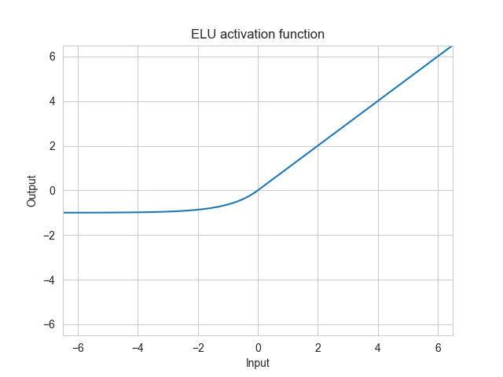

## [Hardshrink activation function](https://pytorch.org/docs/stable/generated/torch.nn.Hardshrink.html)

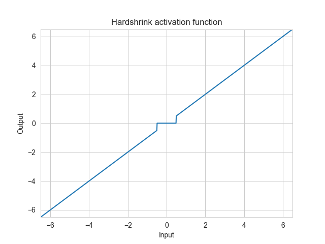

## [Hardsigmoid activation function](https://pytorch.org/docs/stable/generated/torch.nn.Hardsigmoid.html)

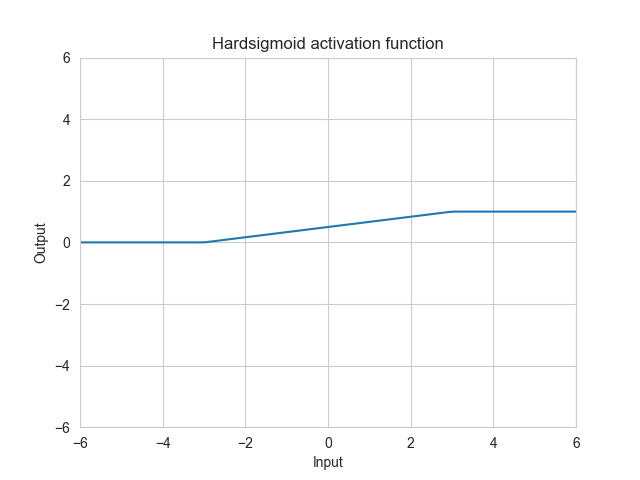

## [Hardtanh activation function](https://pytorch.org/docs/stable/generated/torch.nn.Hardtanh.html)

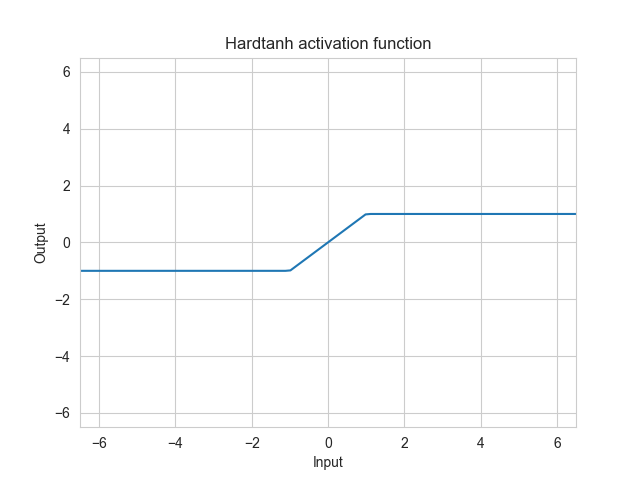

## [Hardswish activation function](https://pytorch.org/docs/stable/generated/torch.nn.Hardswish.html)

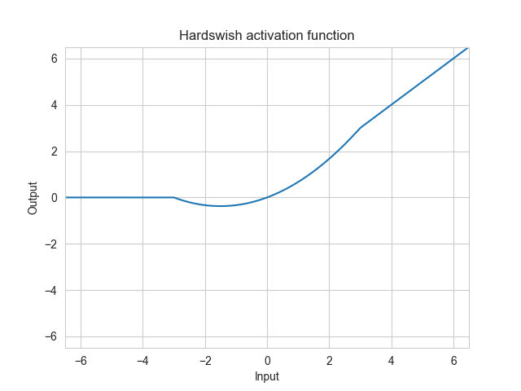

## [LeakyReLU activation function](https://pytorch.org/docs/stable/generated/torch.nn.LeakyReLU.html)

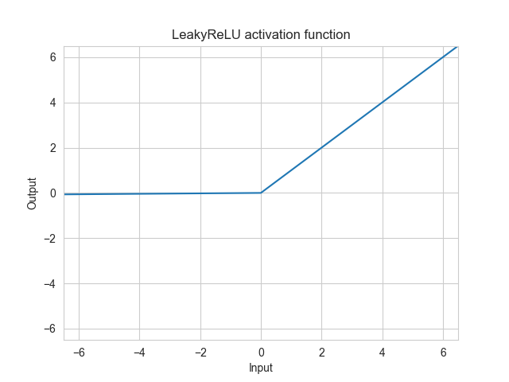

## [LogSigmoid activation function](https://pytorch.org/docs/stable/generated/torch.nn.LogSigmoid.html)

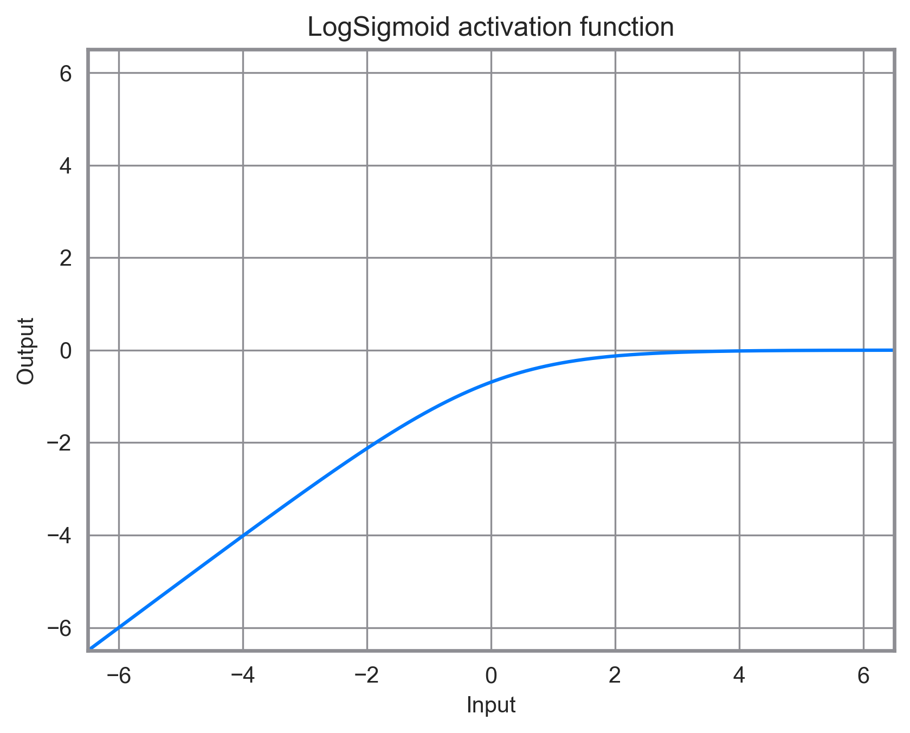

## [ReLU activation function](https://pytorch.org/docs/stable/generated/torch.nn.ReLU.html)

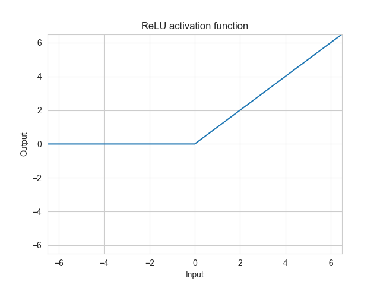

## [ReLU6 activation function](https://pytorch.org/docs/stable/generated/torch.nn.ReLU6.html)

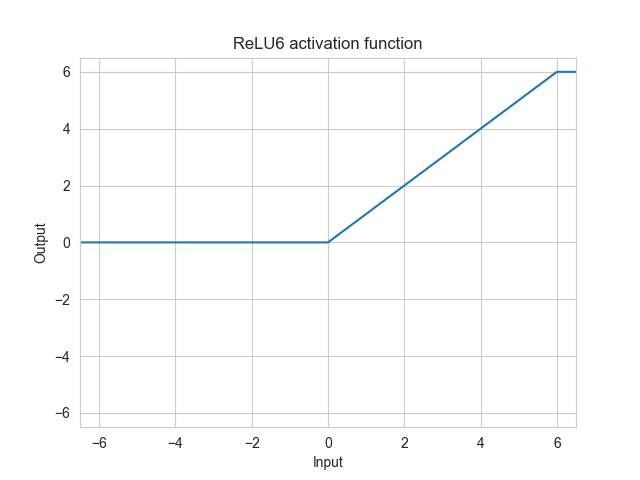

## [SELU activation function](https://pytorch.org/docs/stable/generated/torch.nn.SELU.html)

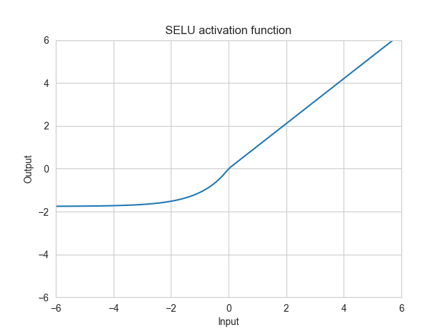

## [CELU activation function](https://pytorch.org/docs/stable/generated/torch.nn.CELU.html)

## [GELU activation function](https://pytorch.org/docs/stable/generated/torch.nn.GELU.html)

## [Sigmoid activation function](https://pytorch.org/docs/stable/generated/torch.nn.Sigmoid.html)

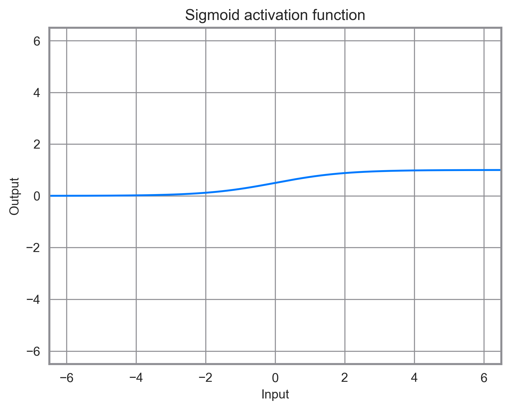

## [Softplus activation function](https://pytorch.org/docs/stable/generated/torch.nn.Softplus.html)

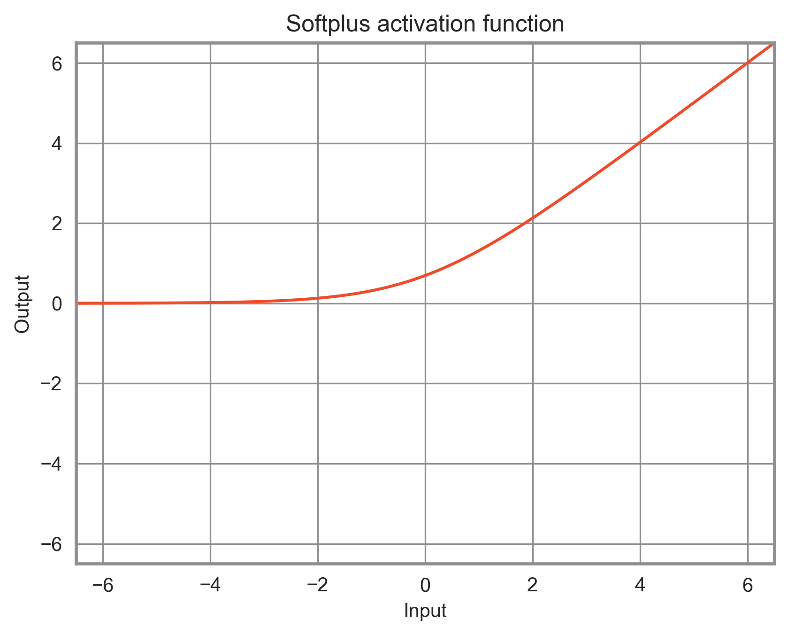

## [Softshrink activation function](https://pytorch.org/docs/stable/generated/torch.nn.Softshrink.html)

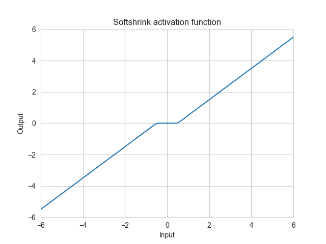

## [Softsign activation function](https://pytorch.org/docs/stable/generated/torch.nn.Softsign.html)

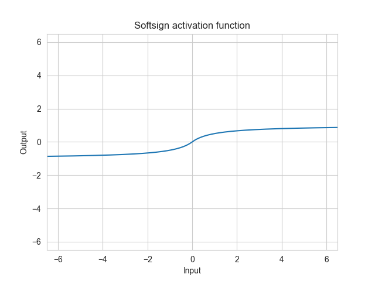

## [Tanh activation function](https://pytorch.org/docs/stable/generated/torch.nn.Tanh.html)

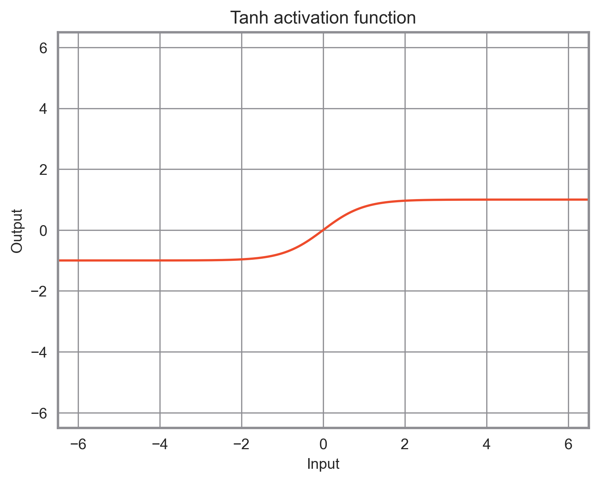

## [Tanhshrink activation function](https://pytorch.org/docs/stable/generated/torch.nn.Tanhshrink.html)

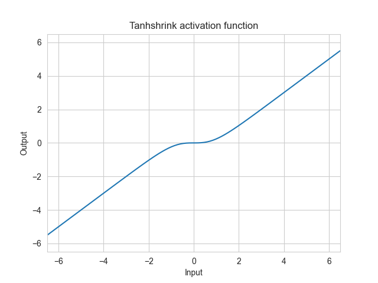

## [Threshold activation function](https://pytorch.org/docs/stable/generated/torch.nn.Threshold.html)

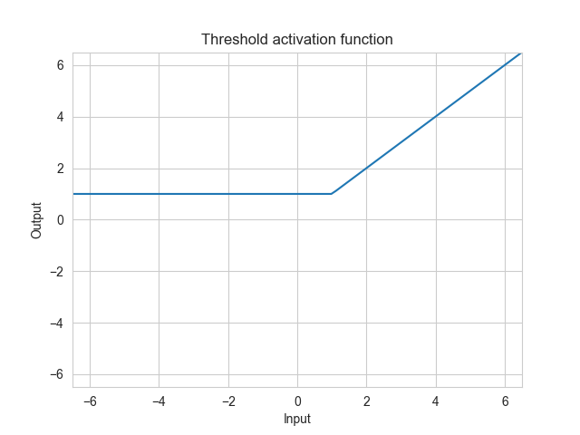

