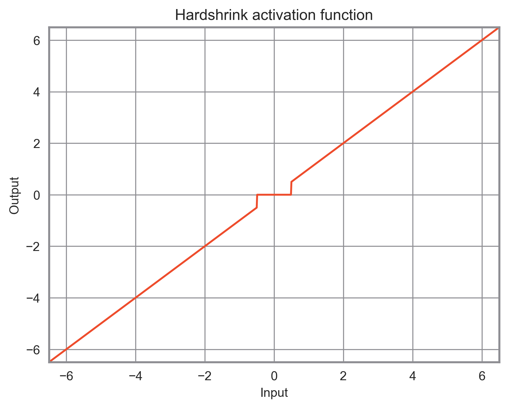
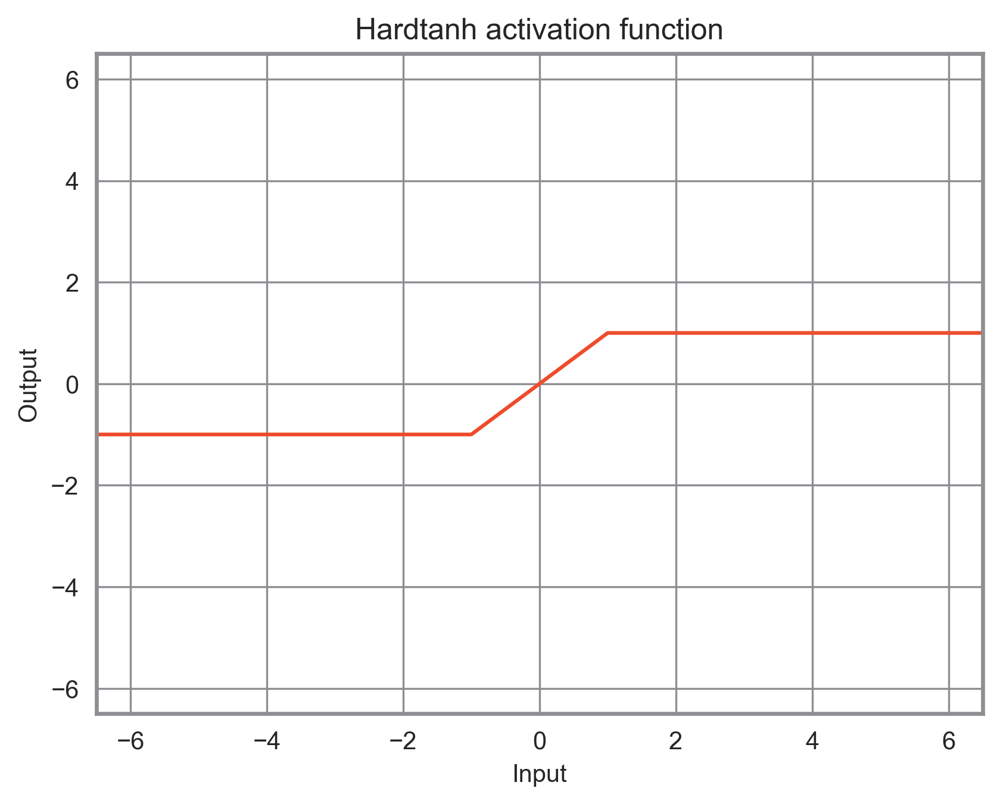
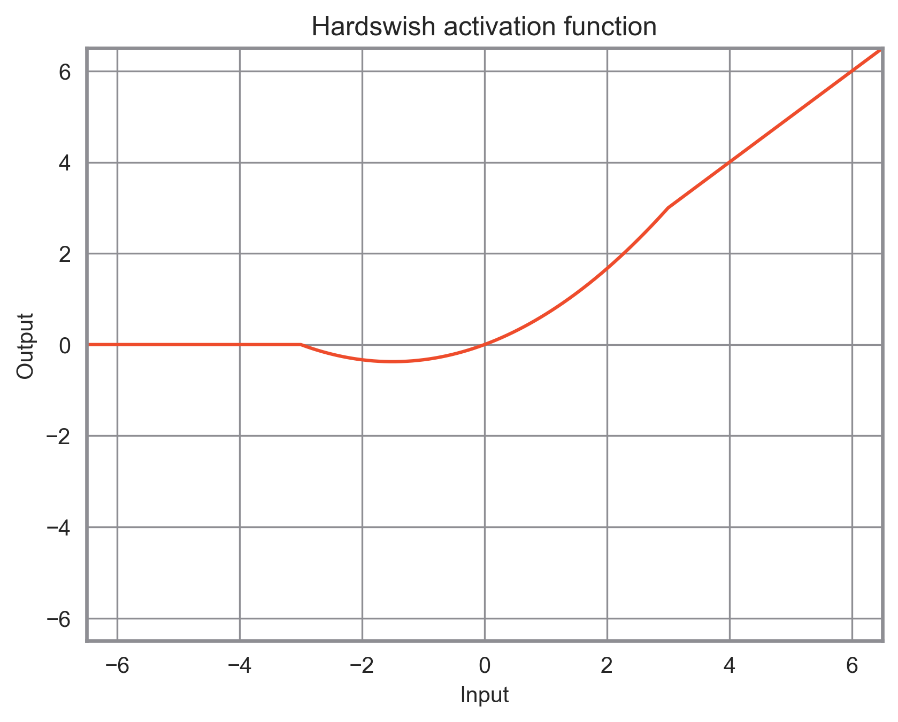
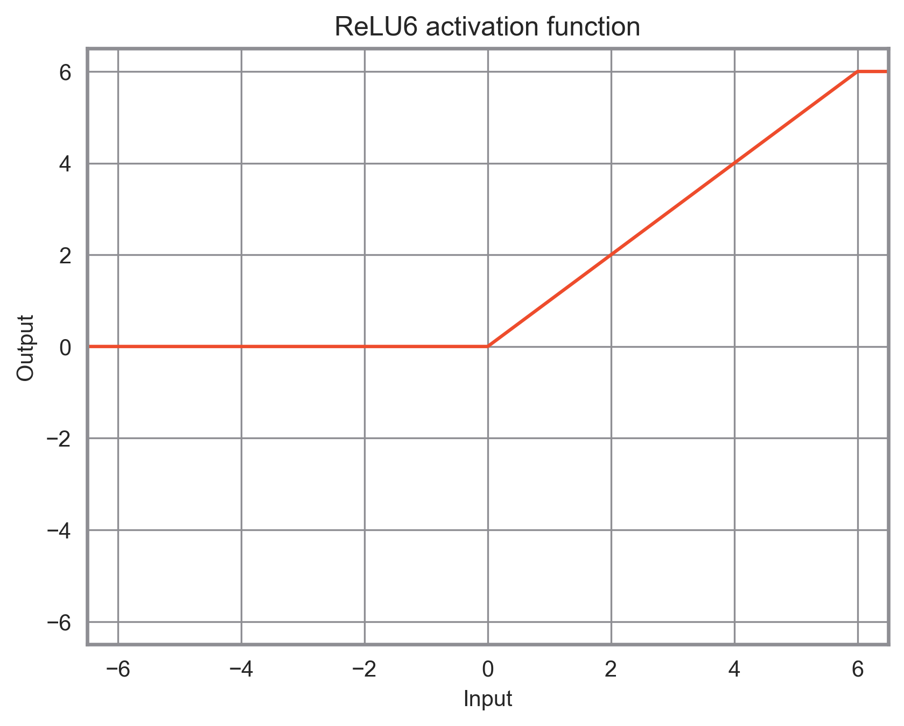
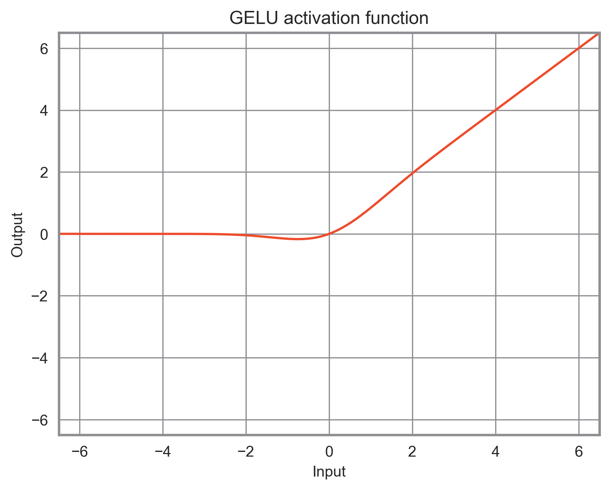
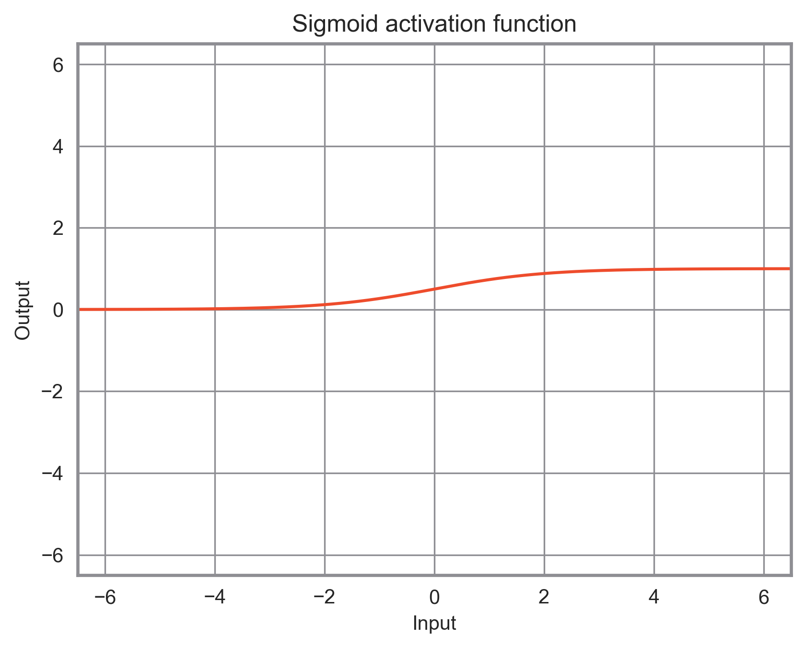
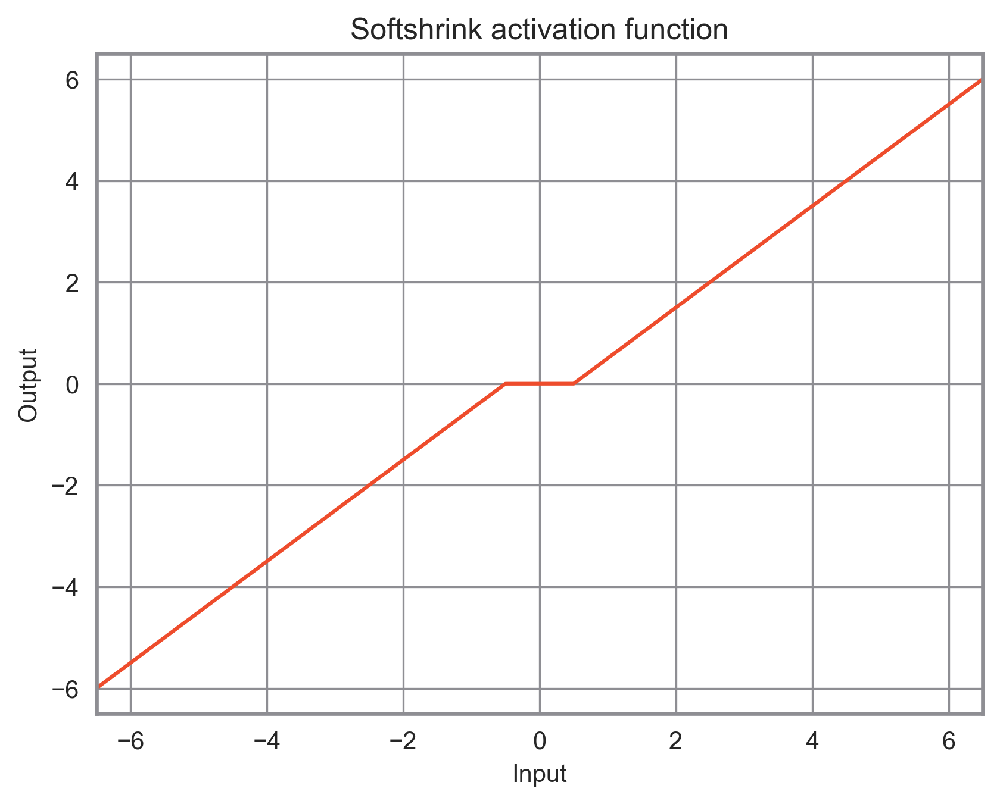
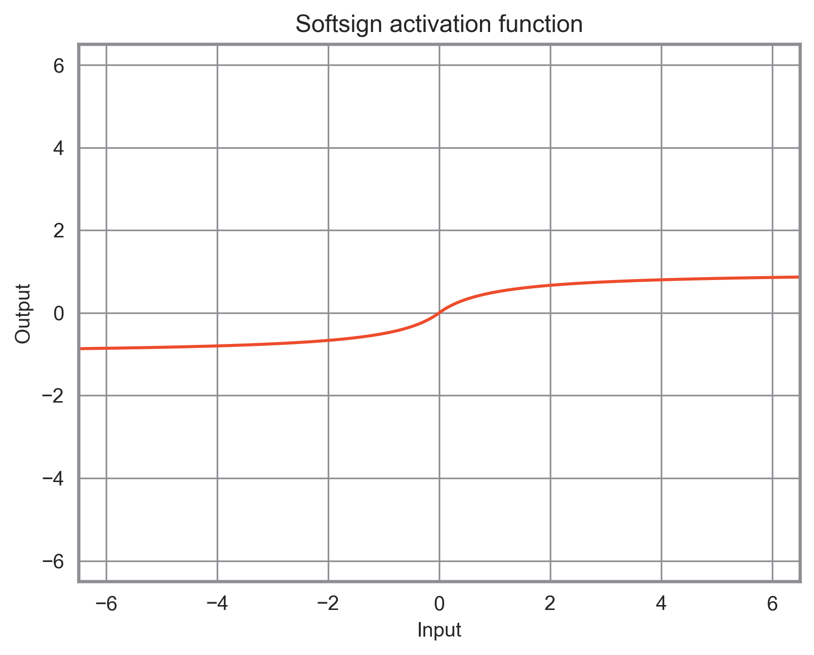

# PyTorch Activations

## ELU activation function

## Hardshrink activation function

## Hardsigmoid activation function

## Hardtanh activation function

## Hardswish activation function

## LeakyReLU activation function

## LogSigmoid activation function

## ReLU activation function

## ReLU6 activation function

## SELU activation function

## CELU activation function

## GELU activation function

## Sigmoid activation function

## Softplus activation function

## Softshrink activation function

## Softsign activation function

## Tanh activation function

## Tanhshrink activation function

## Threshold activation function

